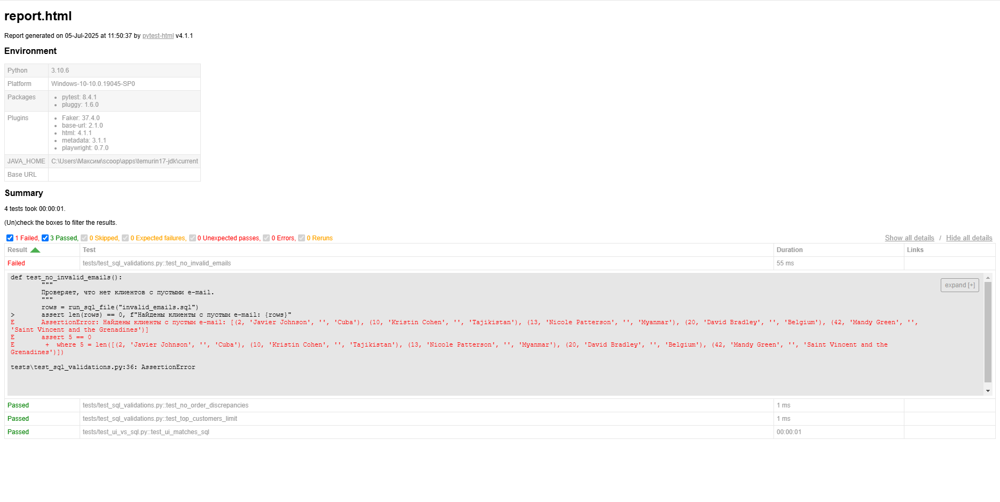

# 🧠 SQL Data Validation + UI Matching — Playwright + Pytest + Faker


Pet-проект по валидации бизнес-данных на уровне базы и UI:  
`Faker → CSV → SQLite → SQL + Pytest → Playwright UI сравнение`

Проект демонстрирует:
- автоматическую генерацию клиентов, заказов, позиций
- SQL-проверки: пустые email, несоответствие сумм, топ клиентов
- сверку UI-таблицы с данными из БД через Playwright
- чистую архитектуру с разделением логики по слоям
- HTML-отчёт Pytest со статусами проверок

---

## ✅ Что покрыто

- 📦 Генерация 50 клиентов, 200 заказов, 500+ позиций через `Faker`
- 🧱 Сборка структуры БД (`schema.sql`) и загрузка CSV (`seed_data.py`)
- 🧪 SQL-проверки:
  - пустые email
  - некорректные суммы заказов
  - топ-5 клиентов по выручке
- 🎭 Сравнение UI-таблицы с результатами SQL-запроса (Page Object + Playwright)
- 📊 Автоматический HTML-отчёт (`pytest-html`)

---

## 📁 Структура проекта

```
sql_ui_validation_project/
├── data/                  # Сырые CSV-файлы
├── db/
│   ├── schema.sql         # Структура таблиц
│   ├── seed_data.py       # Загрузка CSV в SQLite
│   └── database.db        # SQLite база (в .gitignore)
├── generator/
│   └── generate_data.py   # Генерация клиентов/заказов
├── sql_queries/
│   ├── invalid_emails.sql
│   ├── order_discrepancies.sql
│   └── top_customers.sql
├── pages/
│   └── customers_page.py  # Page Object (Playwright)
├── webapp/
│   └── customers.html     # UI-таблица (генерируется)
│   └── generate_customers_html.py
├── tests/
│   ├── test_sql_validations.py
│   └── test_ui_vs_sql.py
├── reports/
│   └── report.html        # HTML-отчёт Pytest
├── requirements.txt
└── README.md
```

---

## 🛠 Установка и запуск

```bash
git clone https://github.com/TomOstin/sql-ui-validation-project.git
cd sql-ui-validation-project

python -m venv .venv
.venv\Scripts\activate           # для Windows
pip install -r requirements.txt
```

---

## ▶️ Генерация и запуск

```bash
python generator/generate_data.py         # Faker → CSV
python db/seed_data.py                    # CSV → SQLite
python webapp/generate_customers_html.py  # SQLite → HTML UI

pytest tests/ --html=reports/report.html --self-contained-html
```

---

## 📊 Пример HTML-отчёта



---

## ⚠️ Почему один тест "падает"

Тест `test_no_invalid_emails()` намеренно выявляет клиентов с пустым e-mail.  
На этапе генерации данных мы закладываем **5% аномалий** (отсутствие e-mail) для демонстрации реальных проверок. Это не баг в тесте — это валидатор данных, работающий как положено.

---

## ⚙️ Стек технологий

- Python 3.10+
- Faker
- SQLite3
- Pytest
- Playwright (sync)
- Pytest-HTML
- Page Object Pattern

---

## 👨‍💻 Автор

**Tom Ostin**  
Python-разработчик и QA-инженер  
[GitHub: TomOstin](https://github.com/TomOstin)  
[Telegram: @tom_ostin](https://t.me/tom_ostin)
